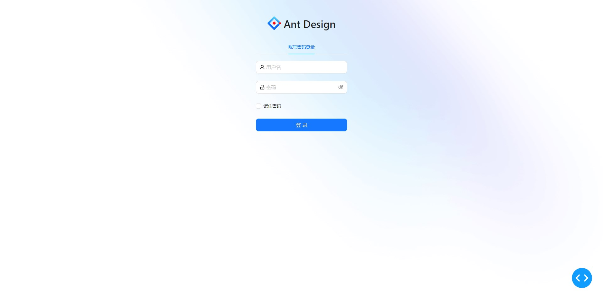

# Dash Login Template

#### 介绍
dash登录模版，目前只搞了个简单的登录，后续正在开发中，参考的Feffery老师的登录模版(或者说抄)

## 使用
克隆后，在项目根目录下运行app.py，之后打开http://127.0.0.1:8050/，初始账号和密码都是DreamGery

## PS
本人python纯自学, 所以代码写得很烂, 别骂孩子

## 预览图片

